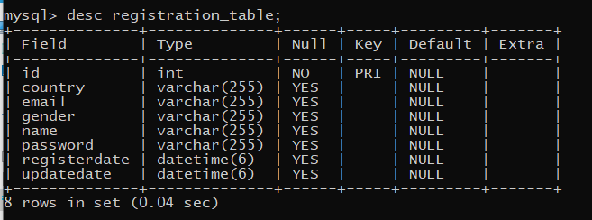
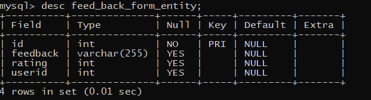
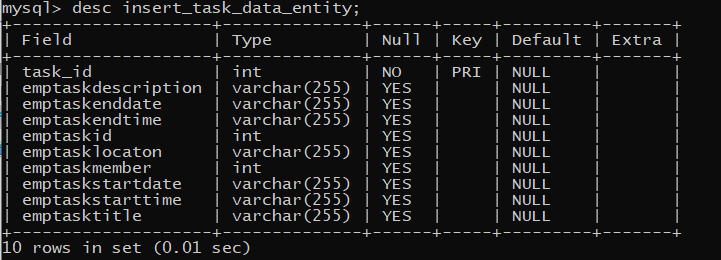

# TASK-Management-System ( Task Project )
 ### ResoTechSolutions:
 #### *Spring Boot and ReactJS web application for task management .*
## Demo
(https://drive.google.com/drive/folders/1azX70RIz9IV47uUICIeR4i2A7_bA7HZr?usp=sharing)

## Introduction
- Task management system is a demonstration web application developed for own project works where users can manage various tasks individualy.
- Developed on Spring Boot(backend) with Raect js (front-end) frameworks and MySql database.
- Project is focused primarily on handling document-based projects.
- “User” can be a member of single define Programs. And one program can have any number of User members associated with it.
- But The Member Adding Functinality is till In Process..
- The project is in an early stage of development and needs lots of work and bug fixing to make it usable in real life. Still, learners can use this as template and make it functinal application.
- I would be happy to see people contribute and enhance this project.
- I implemented various functionality in My task management system, such as login, registration, task creation, task updates, and more.
### TODO:
- Lots of UI/UX improvements.
- New features like Program settings, custom project themes, use settings, and edit details,multiple User Communication.
- Add More Different functionality.

### TOOL:
- Front-End : Vs Code.
- Back End  :  Eclips IDE.
## Dependencies
- Java 8 JDK
- Embedded Tomcat 9 server
- MySQL Database
- Swagger 
- Maven
## Installation
### Backend
 - In Eclipse or similar IDE import the "backend" from this repo with option "import existing maven project".
 - Build the maven project to install all the required dependencies.
 - To setup database, install MySQL. Make any database.
 - Then update below three configuration fields in file **application.properties** inside **/resources** folder

>
    spring.datasource.url=jdbc:mysql://localhost:3306/databasename
    spring.datasource.username=root
    spring.datasource.password=yourpassword
-- Run the project from **BackendApplication.java**, all the tables will be initialised in database with its first run.
### Frontend
- You should have node.js installed on your system.
- GOTO the path of **frontend** folder in comand-prompt and run `npm start`.
- Now your frontend will be hosted on http://localhost:3000 ,open this link in browser.(only for DEV)

### Frontend
- You should have node.js installed on your system.
- GOTO the path of **frontend** folder in comand-prompt and run `npm start`.
- Now your frontend will be hosted on http://localhost:3000 ,open this link in browser.(only for DEV)

### Database 
-Mysql Data Base is Used 
-Table's Description 
-

-

-

-

You can connect to me at [Linkedin](https://www.linkedin.com/in/amol-garje-21b92a231/)
  
